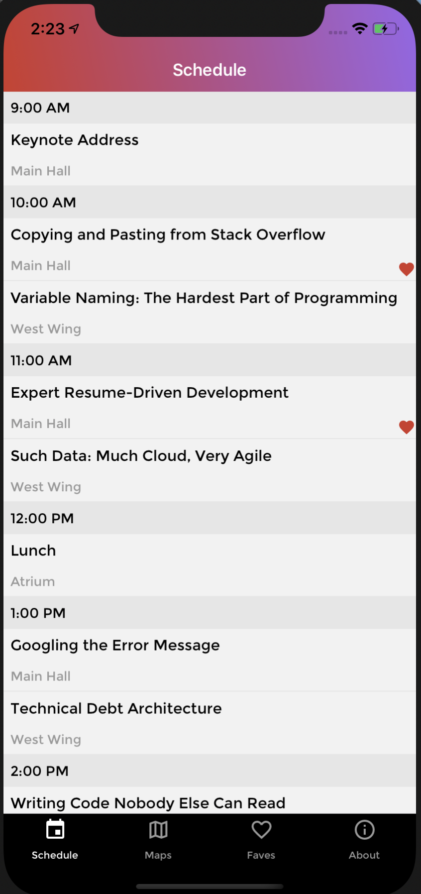
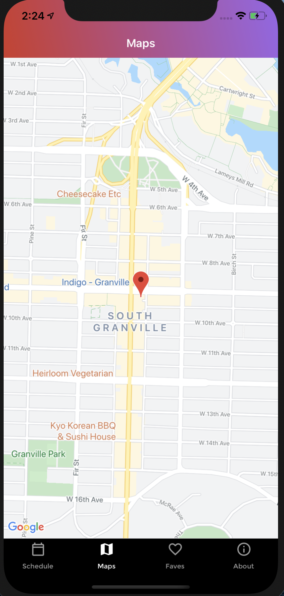
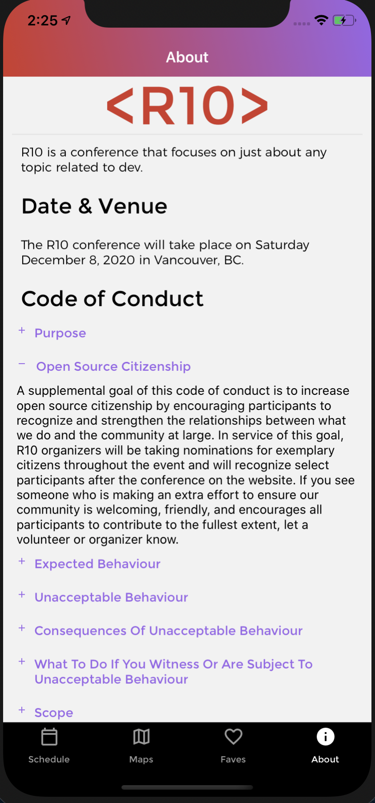
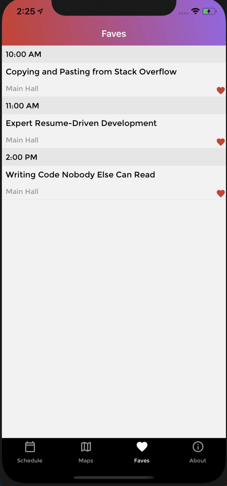
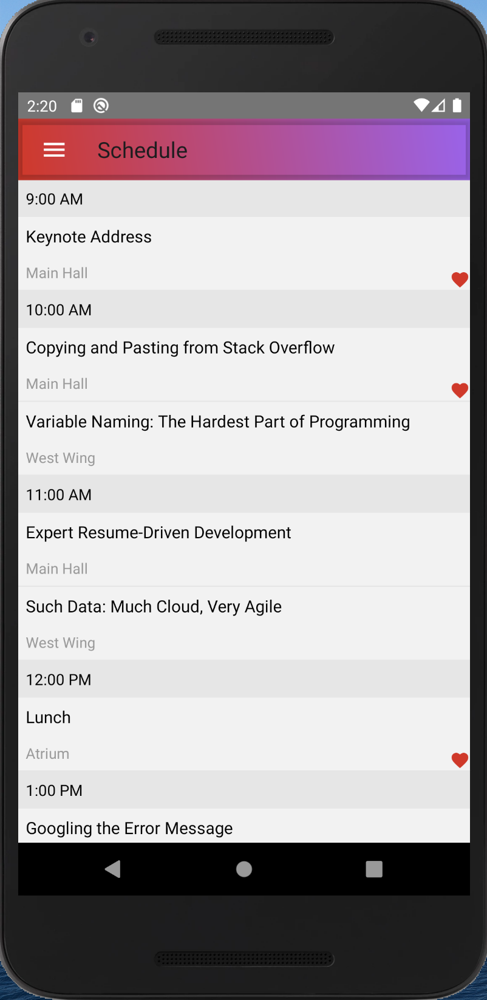
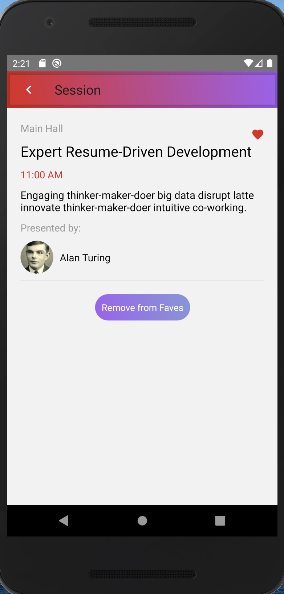

# R10

A mobile application using React Native for an upcoming developer conference called R10. It runs both on iOS and Android.

### Technologies Used:

- [React Native](https://reactnative.dev/): (Mobile application framework used to develop applications for iOS and Android)
- [GraphQL](https://graphql.org/): (Data query and manipulation language for APIs, and a runtime for fulfilling queries with existing data)
- [Apollo Client](https://www.apollographql.com/docs/react/): (State management library for JavaScript apps)
- [React Navigation](https://reactnavigation.org/): (Routing and navigation for React Native apps)

### Installation

```bash
yarn install
```

#### Pod Install for iOS

```
cd ios
pod install
cd ..
```

### Run

```bash
yarn ios
yarn android
```

<br/>




<br/>




### Key Learnings

I had a lot of fun with this project. React Native is a quick and straightforward library for build applications.
